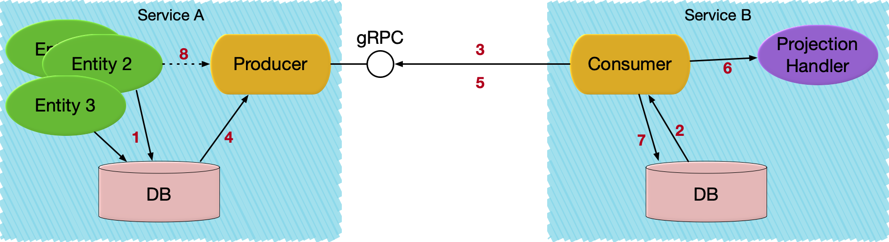

# Pekko Projection gRPC

Pekko Projection gRPC can be used for implementing asynchronous event based service-to-service communication.
It provides an implementation of an Apache Pekko Projection that uses
@extref:[Apache Pekko gRPC](pekko-grpc:index.html) as underlying transport between event producer and consumer.

@@@ warning

This module is currently marked as @extref:[May Change](pekko:common/may-change.html)
in the sense that the API might be changed based on feedback from initial usage.
However, the module is ready for usage in production and we will not break serialization format of
messages or stored data.

@@@

## Overview



1. An Entity stores events in its journal in service A.
1. Consumer in service B starts an Apache Pekko Projection which locally reads its offset for service A's replication stream.
1. Service B establishes a replication stream from service A.
1. Events are read from the journal.
1. Event is emitted to the replication stream.
1. Event is handled.
1. Offset is stored.
1. Producer continues to read new events from the journal and emit to the stream. As an optimization, events can also be published directly from the entity to the producer.

## Dependencies

To use the gRPC module of Apache Pekko Projections add the following dependency in your project:

@@dependency [sbt,Maven,Gradle] {
  group=org.apache.pekko
  artifact=pekko-projection-grpc_$scala.binary.version$
  version=$project.version$
}

Apache Pekko Projections require Pekko $pekko.version$ or later, see @ref:[Pekko version](overview.md#pekko-version).

@@project-info{ projectId="grpc" }

It is currently only possible to use @extref:[Apache Pekko-persistence-r2dbc](pekko-persistence-r2dbc:projection.html) as the
projection storage and journal for this module.

@@dependency [sbt,Maven,Gradle] {
group=org.apache.pekko
artifact=pekko-persistence-r2dbc_$scala.binary.version$
version=$pekko.r2dbc.version$
group2=org.apache.pekko
artifact2=pekko-projection-r2dbc_$scala.binary.version$
version2=$pekko.r2dbc.version$
}

### Transitive dependencies

The table below shows `pekko-projection-grpc`'s direct dependencies, and the second tab shows all libraries it depends on transitively.

@@dependencies{ projectId="grpc" }

## Consumer

On the consumer side the `Projection` is an ordinary @ref:[SourceProvider for eventsBySlices](eventsourced.md#sourceprovider-for-eventsbyslices)
that is using `eventsBySlices` from the @apidoc[GrpcReadJournal].

The Protobuf descriptors are defined when the @apidoc[GrpcReadJournal] is created. The descriptors are used
when deserializing the received events. @scala[The `protobufDescriptors` is a list of the `javaDescriptor` for the used protobuf messages.
It is defined in the ScalaPB generated `Proto` companion object.]
Note that GrpcReadJournal should be created with the @apidoc[GrpcReadJournal$] @scala[`apply`]@java[`create`] factory method
and not from configuration via `GrpcReadJournalProvider` when using Protobuf serialization.

The gRPC connection to the producer is defined in the [consumer configuration](#consumer-configuration).

The @extref:[R2dbcProjection](pekko-persistence-r2dbc:projection.html) has support for storing the offset in a relational database using R2DBC.

The above example is using the @extref:[ShardedDaemonProcess](pekko:typed/cluster-sharded-daemon-process.html) to distribute the instances of the Projection across the cluster.
There are alternative ways of running the `ProjectionBehavior` as described in @ref:[Running a Projection](running.md)

How to implement the `EventHandler` and choose between different processing semantics is described in the @extref:[R2dbcProjection documentation](pekko-persistence-r2dbc:projection.html).

### gRPC client lifecycle

When creating the @apidoc[GrpcReadJournal] a gRPC client is created for the target producer. The same `GrpcReadJournal`
instance and its gRPC client should be shared for the same target producer. The code examples above will share the instance
between different Projection instances running in the same `ActorSystem`. The gRPC clients will automatically be
closed when the `ActorSystem` is terminated.

If there is a need to close the gRPC client before `ActorSystem` termination the `close()` method of the @apidoc[GrpcReadJournal]
can be called. After closing the `GrpcReadJournal` instance cannot be used again.

## Producer

Apache Pekko Projections gRPC provides the gRPC service implementation that is used by the consumer side. It is created with the @apidoc[EventProducer$].

Events can be transformed by application specific code on the producer side. The purpose is to be able to have a
different public representation from the internal representation (stored in journal). The transformation functions
are registered when creating the `EventProducer` service. Here is an example of one of those transformation functions
accessing the projection envelope to include the shopping cart id in the public message type passed to consumers.

To omit an event the transformation function can return @scala[`None`]@java[`Optional.empty()`].

That `EventProducer` service is started in an Apache Pekko gRPC server.

The Pekko HTTP server must be running with HTTP/2. This is the default since Pekko HTTP 2.0.0.

This example includes an application specific `ShoppingCartService`, which is unrelated to Pekko Projections gRPC,
but it illustrates how to combine the `EventProducer` service with other gRPC services.

## Filters

By default, events from all entities of the given entity type and slice range are emitted from the producer to the
consumer. The transformation function on the producer side can omit certain events, but the offsets for these
events are still transferred to the consumer, to ensure sequence number validations and offset storage.

Filters can be used when a consumer is only interested in a subset of the entities. The filters can be defined
on both the producer side and on the consumer side, and they can be changed at runtime.

### Tags

Tags are typically used for the filters, so first an example of how to tag events in the entity. Here, the tag is
based on total quantity of the shopping cart, i.e. the state of the cart. The tags are included in the
@apidoc[pekko.persistence.query.typed.EventEnvelope].

### Producer defined filter

The producer may define a filter function on the `EventProducerSource`.

In this example the decision is based on tags, but the filter function can use anything in the
@apidoc[pekko.persistence.query.typed.EventEnvelope] parameter or the event itself. Here, the entity sets the tag based
on the total quantity of the shopping cart, which requires the full state of the shopping cart and is not known from
an individual event.

Note that the purpose of the `withProducerFilter` is to toggle if all events for the entity are to be emitted or not.
If the purpose is to filter out certain events you should instead use the `Transformation`.

The producer filter is evaluated before the transformation function, i.e. the event is the original event and not
the transformed event.

A producer filter that excludes an event wins over any consumer defined filter, i.e. if the producer filter function
returns `false` the event will not be emitted.

### Consumer defined filter

The consumer may define declarative filters that are sent to the producer and evaluated on the producer side
before emitting the events.

Consumer filters consists of exclude and include criteria. In short, the exclude criteria are evaluated first and
may be overridden by an include criteria. More precisely, they are evaluated according to the following rules:

* Exclude criteria are evaluated first.
* If no matching exclude criteria the event is emitted.
* If an exclude criteria is matching the include criteria are evaluated.
* If no matching include criteria the event is discarded.
* If matching include criteria the event is emitted.

The exclude criteria can be a combination of:

* `ExcludeTags` - exclude events with any of the given tags
* `ExcludeRegexEntityIds` - exclude events for entities with entity ids matching the given regular expressions
* `ExcludeEntityIds` - exclude events for entities with the given entity ids

To exclude all events you can use `ExcludeRegexEntityIds` with `.*`.

The exclude criteria can be a combination of:

* `IncludeTags` - include events with any of the given tags
* `IncludeRegexEntityIds` - include events for entities with entity ids matching the given regular expressions
* `IncludeEntityIds` - include events for entities with the given entity ids

The filter is updated with the @apidoc[ConsumerFilter] extension.

Note that the `streamId` must match what is used when initializing the `GrpcReadJournal`, which by default is from
the config property `pekko.projection.grpc.consumer.stream-id`.

The filters can be dynamically changed in runtime without restarting the Projections or the `GrpcReadJournal`. The
updates are incremental. For example if you first add an `IncludeTags` of tag `"medium"` and then update the filter
with another `IncludeTags` of tag `"large"`, the full filter consists of both `"medium"` and `"large"`.

To remove a filter criteria you would use the corresponding @apidoc[ConsumerFilter.RemoveCriteria], for example
`RemoveIncludeTags`.

The updated filter is kept and remains after restarts of the Projection instances. If the consumer side is
running with Apache Pekko Cluster the filter is propagated to other nodes in the cluster automatically with
Pekko Distributed Data. You only have to update at one place and it will be applied to all running Projections
with the given `streamId`.

@@@ warning
The filters will be cleared in case of a full Cluster stop, which means that you
need to take care of populating the initial filters at startup.
@@@

See @apidoc[ConsumerFilter] for full API documentation.

### Event replay

When the consumer receives an event that is not the first event for the entity, and it hasn't processed and stored
the offset for the preceding event (previous sequence number) a replay of previous events will be triggered.
The reason is that the consumer is typically interested in all events for an entity and must process them in
the original order. Even though this is completely automatic it can be good to be aware of since it may have
a substantial performance impact to replay many events for many entities.

The event replay is triggered "lazily" when a new event with unexpected sequence number is received, but with
the `ConsumerFilter.IncludeEntityIds` it is possible to explicitly define a sequence number from which the
replay will start immediately. You have the following choices for the sequence number in the `IncludeEntityIds`
criteria:

* if the previously processed sequence number is known, the next (+1) sequence number can be defined
* `1` can be used to for replaying all events of the entity
* `0` can be used to not replay events immediately, but they will be replayed lazily as described previously

Any duplicate events are filtered out by the Projection on the consumer side. This deduplication mechanism depends
on how long the Projection will keep old offsets. You may have to increase the configuration for this, but that has
the drawback of more memory usage.

```
pekko.projection.r2dbc.offset-store.time-window = 15 minutes
```

Application level deduplication of idempotency may be needed if the Projection can't keep enough offsets in memory.

## Sample projects

Source code and build files for complete sample projects can be found in `apache/pekko-projection` GitHub repository.


## Access control

### From the consumer

The consumer can pass metadata, such as auth headers, in each request to the producer service by passing @apidoc[pekko.grpc.*.Metadata] to the @apidoc[GrpcQuerySettings] when constructing the read journal.

### In the producer

Authentication and authorization for the producer can be done by implementing a @apidoc[EventProducerInterceptor] and pass
it to the `grpcServiceHandler` method during producer bootstrap. The interceptor is invoked with the stream id and
gRPC request metadata for each incoming request and can return a suitable error through @apidoc[pekko.grpc.GrpcServiceException]

## Performance considerations

### Lower latency

See @extref:[Publish events for lower latency of eventsBySlices](pekko-persistence-r2dbc:query.html#publish-events-for-lower-latency-of-eventsbyslices)
for low latency use cases.

### Scalability limitations

Each connected consumer will start a `eventsBySlices` query that will periodically poll and read events from the journal.
That means that the journal database will become a bottleneck, unless it can be scaled out, when number of consumers increase.
The producer service itself can easily be scaled out to more instances.

For the case of many consumers of the same event stream a future improvement to reduce the
database load would be to share results of the queries across the different consumers, since most of them are
probably reading at the tail of the same event stream.

## Configuration

### Consumer configuration

The `client` section in the configuration defines where the producer is running. It is an @extref:[Apache Pekko gRPC configuration](pekko-grpc:client/configuration.html#by-configuration) with several connection options.

### Reference configuration

The following can be overridden in your `application.conf` for the Projection specific settings:

@@snip [reference.conf](/grpc/src/main/resources/reference.conf) {}

### Connecting to more than one producer

If you have several Projections that are connecting to different producer services they can be configured as separate
@apidoc[GrpcReadJournal] configuration sections.

```
consumer1 = ${pekko.projection.grpc.consumer}
consumer1 {
  client {
    host = "127.0.0.1"
    port = 8101
  }
}

consumer2 = ${pekko.projection.grpc.consumer}
consumer2 {
  client {
    host = "127.0.0.1"
    port = 8202
  }
}
```

The `GrpcReadJournal` plugin id is then `consumer1` and `consumer2` instead of the default `pekko.projection.grpc.consumer`.
